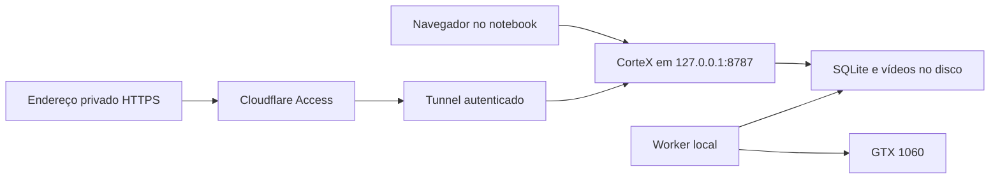

# Abrir o CorteX sem terminal e com endereço privado

## Recomendação

Para usar principalmente neste notebook, servir o build React pela própria API
em `http://127.0.0.1:8787` e iniciar API + worker como serviço do usuário Linux.
O projeto agora fornece esse caminho. O site pode ser um favorito ou o atalho
CorteX no menu de aplicativos; Vite não precisa ficar rodando.

Para um domínio privado: **Cloudflare Access → Tunnel → essa mesma API local**.
A interface, API, SSE, fontes e mídia ficam na mesma origem. Isso reduz configuração
e evita ligar diretamente uma página HTTPS a um servidor HTTP no localhost.
O acesso exige login autorizado; esconder o link não controla acesso.



## O que Pages/Workers fariam

| Opção | Serve a interface | Usa a GTX 1060 | Disponível com notebook desligado |
| --- | --- | --- | --- |
| Serviço local | Sim | Sim, pelo worker | Não |
| Local + Tunnel/Access | Sim | Sim, pelo worker | Não |
| Workers Static Assets ou Pages + backend local | Sim | Só através do backend conectado | Apenas a interface; mídia/jobs locais ficam indisponíveis |
| Processamento todo na nuvem | Exigiria outra infraestrutura | Não usa sua GPU | Exigiria compute/storage separados |

Workers Free tem limites documentados de 10 ms de CPU por invocação e 128 MB de
memória; não é o ambiente para este processo Python, modelos locais, Chromium e
FFmpeg de longa duração. Static Assets atende a interface gratuitamente, mas
isso não fornece o backend nem hospeda a biblioteca de podcasts.
[Limites Workers](https://developers.cloudflare.com/workers/platform/limits/),
[Static Assets](https://developers.cloudflare.com/workers/static-assets/billing-and-limitations/).

Cloudflare documenta Tunnel/Access para aplicações self-hosted. A inferência de
arquitetura aqui é que este caminho exige menos peças para seu uso individual.
[Aplicação privada](https://developers.cloudflare.com/cloudflare-one/setup/secure-private-apps/private-web-app/).
O free tier e as condições da conta precisam ser confirmados no painel antes de
publicar; nenhum serviço pago, domínio ou storage foi contratado nesta revisão.

O notebook precisa estar ligado, com sessão e serviço ativos. Suspensão para
processamento e conectividade. Um site não liga a GPU nem dá acesso ao disco por
conta própria. A biblioteca local não é backup: salvar código no GitHub também
não salva vídeos, SQLite e presets de usuário que estão em `data/`.

## Operação local

Depois de instalar dependências conforme README:

```bash
cd apps/web && npm ci && npm run build
cd ../remotion && npm ci && npm run build
cd ../..
.venv/bin/python scripts/install_local_service.py --install
systemctl --user start cortex.service
```

O instalador habilita início no login e cria atalho. Não inicia jobs durante a
instalação. O serviço executa `scripts/studio.sh`, mantém API e worker juntos e
reinicia o conjunto se um deles encerrar. Usa o mesmo usuário do login Codex,
resolve o PATH de Node/Codex instalado e lê `.env` via systemd sem copiar seus
segredos. Reinicie o serviço depois de atualizar código; recompile a interface.
Não rode `dev.sh` ou outro worker simultaneamente com esse serviço.

```bash
systemctl --user status cortex.service
journalctl --user -u cortex.service -n 60 --no-pager
systemctl --user restart cortex.service
systemctl --user disable --now cortex.service
```

Desabilitar não apaga mídia, jobs ou configurações. O atalho é instalado em
`~/.local/share/applications/cortex.desktop` e o unit em
`~/.config/systemd/user/cortex.service` (respeitando XDG). O endereço padrão do
atalho é 8787; ele lê a porta efetiva que o serviço registra localmente. O atalho
inicia o serviço e aguarda health antes de abrir o navegador. Não é configurado
`linger`: iniciar antes do login ou manter após logout é uma decisão operacional
separada. Jobs interrompidos podem exigir retentativa; serviço automático não
resolve a fila de lote ainda pendente.

## Publicação futura com Cloudflare

Pré-requisitos concretos: domínio escolhido na conta Cloudflare, identidade
autorizada do usuário, serviço local funcionando e `cloudflared` instalado.

1. Criar aplicação Access para o hostname completo com Allow apenas para o
   usuário autorizado; proteger UI, `/api`, mídia e eventos, sem rota bypass.
2. Criar Tunnel gerenciado apontando ao serviço HTTP `127.0.0.1:8787`.
3. Habilitar **Protect with Access** no Tunnel para validar o token também no
   caminho até a origem. Não confiar apenas em cabeçalho de email.
4. Manter API vinculada ao loopback e evitar cache compartilhado para conteúdo
   privado. Testar sessão anônima negada, autorizada aceita e expiração de sessão.
5. Testar SSE/reconexão, vídeo com Range/seek e download. Importar YouTube pelo
   link faz o notebook baixar o vídeo; não envia o master pelo browser.
6. Testar upload de arquivo separadamente: o proxy no plano Free tem limite
   documentado de 100 MB por request; upload local continua útil para masters
   grandes até existir protocolo de upload em partes.

Referências: [Access e validação na origem](https://developers.cloudflare.com/cloudflare-one/access-controls/applications/http-apps/self-hosted-public-app/),
[limites de request](https://developers.cloudflare.com/workers/platform/limits/).
Evitar Quick Tunnel como solução permanente; o projeto usa SSE e a documentação
do Quick Tunnel registra limitações para esse caso.
[Quick Tunnels](https://developers.cloudflare.com/cloudflare-one/networks/connectors/cloudflare-tunnel/do-more-with-tunnels/trycloudflare/).

Mídia de preview/download passando pelo proxy precisa ser validada contra limites
e condições vigentes; não assumir que o free tier é hospedagem ilimitada de vídeo.
Não há necessidade de adicionar R2/D1 agora. Se a galeria precisar funcionar com
o notebook desligado, sincronizar metadados e cópias de publicação é outro gate,
com política de retenção, autorização e custo explícitos.

Nenhum Tunnel, DNS, Access ou deploy externo foi criado por esta revisão. O
hostname e a identidade autorizada ainda precisam ser definidos para esse passo.
