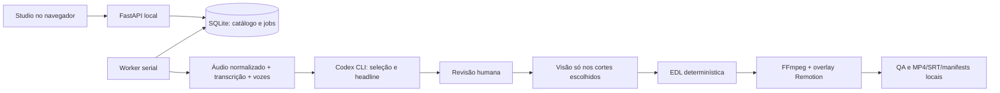

# Revisão do CorteX para Dayon News

Data: 2026-09-10. Escopo: arquitetura, dependências, persistência, interface,
ingestão, seleção Codex, análise audiovisual, render, operação local e opção
Cloudflare. Evidência automatizada e limitações em
[registro desta revisão](evidence/2026-09-10-architecture-review.md).

## Decisão central

Manter Python/FastAPI/SQLite no backend e React/TypeScript na interface.
FFmpeg continua responsável por mídia, faster-whisper pela transcrição,
Codex CLI pela seleção editorial e Remotion pelos overlays animados.
Essas responsabilidades são diferentes e justificam a stack atual. Uma reescrita
em outra linguagem não resolve decodificação redundante, estado no navegador
ou atribuição incorreta de falantes.

O produto deve ser um editor pessoal: **biblioteca → preparar episódio e
identificar Dayon → escolher cortes → revisar/exportar**. Um único arquivo master
por episódio. O notebook continua sendo o servidor de processamento; o navegador
é o controle. A primeira entrega de organização reduz instalações e instruções
ambíguas, sem introduzir serviços de nuvem, filas distribuídas ou outro editor.

## O que explica a experiência ruim

| Problema observado | Consequência | Tratamento |
| --- | --- | --- |
| Render abria o master desde zero, com trims em tempo absoluto (`render/service.py`) | Um corte tardio decodificava o início do podcast novamente | Corrigido: janela física com seek antes do input, rebasing só nos filtros, cache versionado |
| Análise visual já usa intervalos selecionados, mas cache depende do conjunto exato (`analyze/scope.py`, `scene_service.py`) | Acrescentar um corte pode repetir análise anterior | Próximo gate: cache de janelas reutilizáveis, unido com cobertura explícita |
| Faces e qualidade visual extraem amostras com processos separados (`face_service.py`, `visual_quality_service.py`) | Overhead de FFmpeg e decodificação repetida | Decoder compartilhado por janela com amostras de baixa resolução e limite de trabalho |
| Identidade compara observações em pares (`identity_service.py`) | Custo quadrático e cancelamento tardio em conjuntos grandes | Representantes por track/plano, estatística incremental e checkpoints |
| Browser cria o próximo plano/render apenas após o anterior (`App.tsx`) | Fechar a aba deixa parte do lote sem ser enviada | Prioridade P0: lote persistido no SQLite, agendamento pelo worker |
| Escrita do próximo job e avanço do workflow são separados (`worker.py`) | Uma interrupção entre as escritas pode deixar execução incoerente | Transação e reconciliação por chave idempotente |
| Rascunho salvo só em certas ações e estado reaproveitado ao trocar episódio | Perda ou contaminação de ajustes | Corrigido: snapshot versionado por execução, autosave e restauração com defaults |
| Headline tinha renderer e contrato, mas só um toggle na UI | Texto manual inacessível | Corrigido: texto por corte, sugestão da IA quando vazio, preview/render usam o mesmo valor |
| Diarização existia sem testes focados, predominância usava só envelope | Intenção editorial poderia privilegiar outro participante | Corrigido: união temporal, sobreposição conservadora e duas métricas persistidas |
| Handoff com 1.648 linhas misturava versões incompatíveis | Agentes repetiam trabalhos ou seguiam decisões revogadas | Resumo atual curto, mapa de módulos e histórico separado |

O backend tinha **351 testes passando e 3 skips** no início; os 24 testes da tela
App falhavam após a inclusão da biblioteca. Ter motores testados não prova que a
experiência integrada esteja pronta. A validação final está no registro de evidência.

## Manter, simplificar e evitar

| Componente | Decisão | Motivo |
| --- | --- | --- |
| Python + FastAPI + Pydantic | Manter | Bibliotecas de áudio/visão, contratos e serviços existentes |
| SQLite + manifests + arquivos locais | Manter | Um usuário, uma máquina e artefatos auditáveis; transações precisam melhorar |
| FFmpeg/ffprobe | Manter como motor único de mídia | Trim, mix, gblur, encoders, loudness e QA já implementados |
| faster-whisper/CTranslate2 | Manter | Caminho CUDA `int8` compatível com a máquina e cache existente |
| React/TypeScript/Vite | Manter | Interface não é o gargalo pesado; Vite só no desenvolvimento/build |
| Remotion | Manter para legenda/headline | Render animado já existe; não adicionar um segundo motor completo de vídeo |
| Codex CLI | Manter como único editorial | `gpt-5.5`, medium, saída validada, timeout e falhas explícitas |
| Pyannote CPU opcional | Manter isolado, completar validação | Diferencia vozes sem trocar a stack CUDA; não está comprovado em podcast longo |
| OpenCV YuNet/SFace via ONNX | Manter com escopo limitado | Amostrar planos selecionados; evitar rastrear episódio inteiro |
| Frontend PodCLI, mods, migração antiga | Remoções existentes preservadas | Git guarda o histórico; nenhuma dependência runtime desse legado |
| Versões `latest` no frontend | Removidas | Manifest agora fixa versões já resolvidas no lock; tooling está em devDependencies |
| API e worker monolíticos | Extrair por domínio gradualmente | `api.py` ~1.800 linhas, worker ~1.060, render ~1.950: limites dificultam mudanças e revisão |
| Docker, Redis/Celery, Kubernetes, novo framework web | Não adicionar agora | Não resolvem os problemas identificados para uma máquina pessoal |
| React/Remotion compartilhado por import entre apps | Extrair depois para pequeno pacote visual | Uma fonte para preview e export, com contrato sem dependência do renderer inteiro |

Python aceita 3.11–3.14, mas a diarização usa ambiente separado 3.13. Isso tem
custo operacional real; documentar os dois é melhor que misturar Torch e
CTranslate2 às cegas. O backend ainda precisa de um lock reproduzível de
dependências transitivas e uma matriz explícita de Python suportado. Não atualizar
CUDA, Torch ou CTranslate2 junto com mudanças editoriais.

## Arquitetura prática e desempenho

Sequenciar transcrição e tarefas intensivas em GPU. O worker mantém o modelo de
transcrição em memória até encerrar: avaliar descarregamento antes do render e
após ociosidade, medindo VRAM e custo de recarga. Não aumentar concorrência em
GPU de 6 GB sem medição. NVENC acelera encode; filtros, análise e decode atuais
podem continuar em CPU. O código atual não comprova um pipeline NVDEC completo.

A otimização de seek usa uma janela mínima por render, incluindo tempos de áudio,
J/L-cut e vídeo emprestado de reações. Ainda decodifica os espaços internos entre
trechos distantes. O próximo passo é medir esse caso antes de introduzir vários
inputs e complexidade de sincronização. O Gaussian blur existente reduz a imagem
de fundo antes de aplicar `gblur`, o que já evita fazê-lo no canvas inteiro.

Próximos limites operacionais: orçamento de amostras/segundos por análise,
estimativa antes de iniciar, timeout por decoder, cancelamento cooperativo em
loops e reconciliação após reiniciar. Progresso deve mostrar trabalho concluído,
cache e duração observada; posição temporal no podcast não é percentual de trabalho.

## Sua voz e seu rosto

Diarização responde **quem falou quando**, com IDs provisórios. Detecção de rosto
responde **quem está visível**. A câmera pode mostrar o entrevistador enquanto
Dayon fala; confundir essas duas evidências escolhe a pessoa errada.

Fluxo recomendado: informar 2 ou 3 participantes; ouvir amostras das vozes;
confirmar “esta é minha voz”; depois vincular a uma foto confirmada do mesmo
episódio. Persistir esse vínculo como dado revisável. Uma foto sozinha não fornece
identificação acústica confiável. Não reutilizar automaticamente um ID local de
falante em outro episódio; samples e hashes da fonte devem acompanhar a escolha.

Hoje a biblioteca já permite separar vozes e confirmar Dayon. O adapter usa
`pyannote/speaker-diarization-community-1` local em CPU; a primeira instalação
exige baixar pesos e aceitar acesso no Hugging Face. Isso não exige a API paga do
Pyannote. [Projeto oficial](https://github.com/pyannote/pyannote-audio).

Pendências: ligar voz e rosto, atribuir palavras individualmente, revisar
sobreposições e gerar segmentos compactos rotulados para o Codex. O gate desta
revisão verifica predominância no envelope e na proposta `approximate_edl`; o
planner ainda parte do envelope e não consome essa EDL semântica. Portanto,
**a predominância precisa ser revalidada sobre o plano de áudio final**. Esse
desencontro é prioridade de produto, não pode ser coberto por uma promessa de IA.

## Edição para um podcast verdadeiro

Do master do YouTube só podemos usar a câmera que foi transmitida naquele momento.
Não é possível recuperar uma câmera fechada ausente. A edição deve preservar
essa realidade: quadro aberto para contexto, close de Dayon quando disponível,
entrevistador e outro convidado quando a conversa pede. Evitar cortar para outro
instante apenas para aparentar uma reação simultânea; o recurso existente de
reutilizar reações continua opcional e requer revisão.

Enquadramento padrão seguro: master inteiro sobre Gaussian blur. Automático
por cena quando o usuário deseja close, com correção esquerda/direita/ambos e
retorno visível ao quadro inteiro em incerteza. Preferir decisões estáveis dentro
do plano; zoom discreto em mudanças retóricas, sem movimentos nervosos ou regras
de trocar a imagem a cada tantos segundos. Zoom digital também reduz nitidez,
principalmente se o master for 1080p.

Começar no ritmo `balanced`: preservar respiração, pausas de sentido e final das
palavras. `dynamic` precisa de comparação auditiva. J/L-cuts são úteis quando
há handles seguros de fala e contexto visual; não devem deslocar lipsync de uma
pessoa visivelmente falando. O quality gate técnico não substitui ouvir o corte.

Legenda já oferece texto por palavra, tamanho, fonte, peso, posição, cor,
outline, karaoke/pop e export SRT. Priorizar melhorias de alinhamento nos trechos
com erro, dicionário editorial para nomes/termos recorrentes e visualização da
fala real na prévia. Headline agora pode ser manual por corte, com sugestão da IA;
um editor posterior pode expor duração, tamanho e animação já previstos no contrato.

Para retenção: selecionar uma afirmação compreensível logo no início, entregar
contexto suficiente e uma conclusão; diversidade entre cortes para evitar 25
variações da mesma fala. O brief Dayon News deve expressar tema, público, duração,
intenção e pontos indispensáveis; manchetes devem corresponder à fala e conservar
qualificações importantes. Um score de IA é justificativa editorial, não previsão
de viralização. Usar exemplos aprovados/reprovados e resultados reais do perfil
para ajustar seleção. Registrar retenção, conclusão, compartilhamentos e salvamentos
manualmente já oferece aprendizado sem construir uma plataforma de analytics.

## Repositórios que merecem avaliação

| Projeto | Uso possível | Decisão para o CorteX |
| --- | --- | --- |
| [Pyannote](https://github.com/pyannote/pyannote-audio) | Separação local de falantes | Já integrado opcionalmente; concluir testes e benchmark antes de uso longo |
| [WhisperX](https://github.com/m-bain/whisperX) | Alinhamento forçado para corrigir timestamps | Avaliar como etapa opcional em cortes selecionados; não trocar transcrição inteira nem adicionar modelos sem medir |
| [PySceneDetect](https://github.com/Breakthrough/PySceneDetect) | Detector alternativo para cortes/transições difíceis | Benchmark A/B com scdet existente; adotar somente se detectar melhor os estúdios reais |
| [auto-editor](https://github.com/WyattBlue/auto-editor) | Referência para remoção automática de pausas | Comparar ritmo com EDL própria; evitar empilhar dois planners |

WhisperX documenta tradeoff de memória/alinhamento e limitações em fala sobreposta;
não é garantia de diarização perfeita. Cada experimento deve ter um episódio curto,
artefato comparável e critério de remoção. Não importar projetos inteiros para
resolver funções que o FFmpeg/CorteX já possuem.

## Organização para próximos modelos

Começar por `AGENTS.md`, handoff curto e roadmap. O histórico fica em
`docs/history/` e só é aberto para uma investigação específica. Uma fonte por
decisão: arquitetura para limites; roadmap para gates; evidence para comandos e
resultados; prompts/schemas para contrato editorial. Os testes executáveis
decidem se a implementação satisfaz o contrato.

Extrair API por biblioteca/workflows/edição/render e worker por handlers sem
mudar os endpoints. Extrair UI por biblioteca/revisão/exportação e hooks de
acompanhamento. O nome de cada tarefa deve declarar módulo, resultado e teste.
Agentes têm propriedade exclusiva de arquivos, orçamento de resposta e condição
de parada. O modelo de desenvolvimento pode variar conforme disponibilidade;
isso não altera o modelo editorial configurado no produto.

Commits pequenos depois deste checkpoint: primeiro correção observável, depois
refatoração com paridade, depois funcionalidade. Não marcar um gate concluído
somente porque existe botão, endpoint ou teste mockado. A ordem de execução está
em [ROADMAP](ROADMAP.md); a proposta de site privado em
[operação local e Cloudflare](LOCAL_AND_CLOUDFLARE.md).
